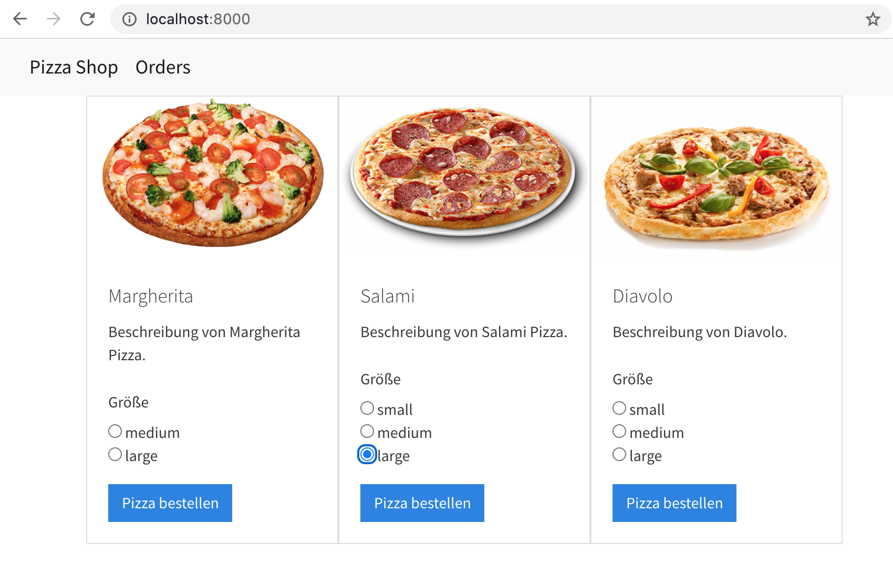
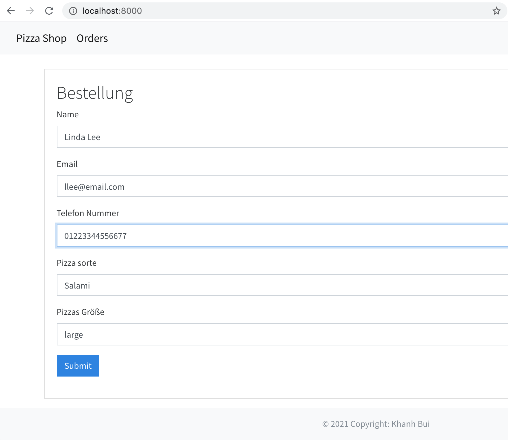
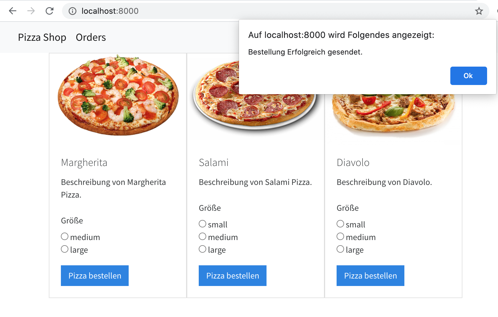
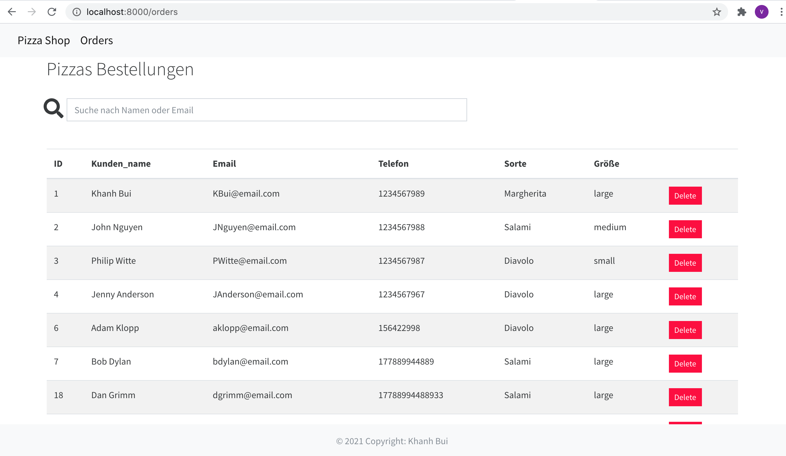
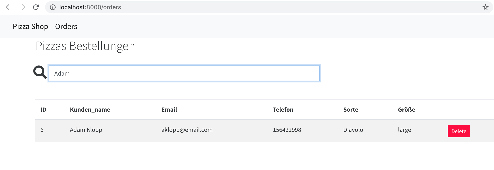

# Pizzashop
Full stack Django/React/Redux app.

## Quick Start 

```
# Install dependencies
npm install

# Activate virtual invironment
pipenv shell 
or 
pipenv run 

# Serve API on localhost:8000
python pizzashop/manage.py runserver

# Run webpack (from root)
npm run dev

# Build for production
npm run build

```
> 1. **localhost:8000/**



> 2. **Pizza bestellen**



> 3. **localhost:8000/orders**



